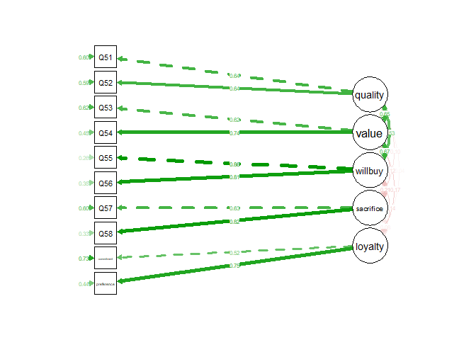
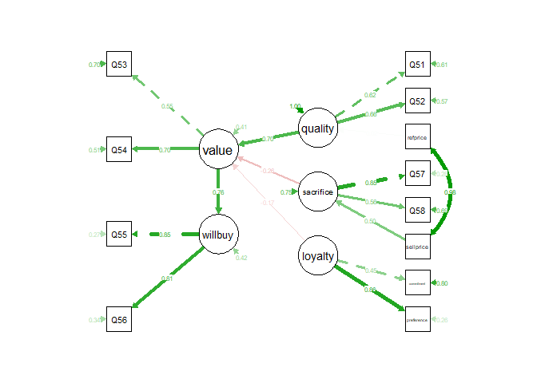

This is the accompanying script and data for the article **Brand loyalty and price-quality perceptions of hybrid maize seed in La Frailesca Chiapas, Mexico** by Ciro Domínguez, Jason Donovan, Romain Frelat, and C.S. Srinivasan currently in review. 
See the *Materials and Methods* section of the article for more details about the data and the method.

# 1. Preliminaries


### Load the packages
The analysis require the packages `lavaan` (v ≥ 0.6), `psych` (v ≥ 2.2.9), and `semPlot` (v ≥ 1.1.6).


```r
library(lavaan)
library(psych)
library(semPlot)
```

If you get an error message, check that the R packages `lavaan`, `psych` and `semPlot` are installed correctly. If not, use the command: `install.packages(c("lavaan", "psych", "semPlot"))`.

### Load the dataset

The dataset containing the 12 variables for the 393 farmers is stored in the csv file `MaizeBrandPrice.csv`, and available for download [here](https://github.com/rfrelat/SEM_MaizeBrandPrice/raw/main/MaizeBrandPrice.csv)

The variables have been scaled so that all the values are within the same range, between -3 and 3. The questions (Q51 to Q58) followed a *7-point Likert scale*, including:  

- “Agree very much”: 3 
- “Agree”: 2
- “Kind of agree”: 1 
- “Do not agree or disagree”: 0 
- “Kind of disagree”: -1 
- “Disagree”: -2
- “Disagree very much”: -3


```r
tab <- read.csv("MaizeBrandPrice.csv")
dim(tab)
```

```
## [1] 393  12
```

```r
names(tab)
```

```
##  [1] "Q51"        "Q52"        "Q53"        "Q54"        "Q55"       
##  [6] "Q56"        "Q57"        "Q58"        "refprice"   "sellprice" 
## [11] "commitment" "preference"
```


# 2. Confirmatory Factor Analysis


```r
CFA.model <- 'quality  =~ Q51 + Q52
              value =~ Q53 + Q54
              willbuy =~ Q55 + Q56
              sacrifice =~ Q57 + Q58
              loyalty  =~ commitment + preference'

fitCFA <- cfa(CFA.model, data=tab, estimator="WLSMV")
summary(fitCFA, fit.measures=TRUE, standardized=TRUE)
```

```
## lavaan 0.6.13 ended normally after 66 iterations
## 
##   Estimator                                       DWLS
##   Optimization method                           NLMINB
##   Number of model parameters                        30
## 
##                                                   Used       Total
##   Number of observations                           380         393
## 
## Model Test User Model:
##                                               Standard      Scaled
##   Test Statistic                                23.008      43.339
##   Degrees of freedom                                25          25
##   P-value (Chi-square)                           0.577       0.013
##   Scaling correction factor                                  0.605
##   Shift parameter                                            5.311
##     simple second-order correction                                
## 
## Model Test Baseline Model:
## 
##   Test statistic                               729.378     446.552
##   Degrees of freedom                                45          45
##   P-value                                        0.000       0.000
##   Scaling correction factor                                  1.704
## 
## User Model versus Baseline Model:
## 
##   Comparative Fit Index (CFI)                    1.000       0.954
##   Tucker-Lewis Index (TLI)                       1.005       0.918
##                                                                   
##   Robust Comparative Fit Index (CFI)                         1.000
##   Robust Tucker-Lewis Index (TLI)                            1.005
## 
## Root Mean Square Error of Approximation:
## 
##   RMSEA                                          0.000       0.044
##   90 Percent confidence interval - lower         0.000       0.020
##   90 Percent confidence interval - upper         0.037       0.065
##   P-value H_0: RMSEA <= 0.050                    0.995       0.650
##   P-value H_0: RMSEA >= 0.080                    0.000       0.002
##                                                                   
##   Robust RMSEA                                               0.034
##   90 Percent confidence interval - lower                     0.016
##   90 Percent confidence interval - upper                     0.051
##   P-value H_0: Robust RMSEA <= 0.050                         0.939
##   P-value H_0: Robust RMSEA >= 0.080                         0.000
## 
## Standardized Root Mean Square Residual:
## 
##   SRMR                                           0.036       0.036
## 
## Parameter Estimates:
## 
##   Standard errors                           Robust.sem
##   Information                                 Expected
##   Information saturated (h1) model        Unstructured
## 
## Latent Variables:
##                    Estimate  Std.Err  z-value  P(>|z|)   Std.lv  Std.all
##   quality =~                                                            
##     Q51               1.000                               0.615    0.635
##     Q52               1.106    0.169    6.553    0.000    0.681    0.640
##   value =~                                                              
##     Q53               1.000                               0.760    0.618
##     Q54               1.035    0.127    8.137    0.000    0.787    0.742
##   willbuy =~                                                            
##     Q55               1.000                               1.081    0.859
##     Q56               0.970    0.079   12.288    0.000    1.048    0.808
##   sacrifice =~                                                          
##     Q57               1.000                               0.984    0.631
##     Q58               1.235    0.528    2.341    0.019    1.216    0.820
##   loyalty =~                                                            
##     commitment        1.000                               0.440    0.515
##     preference        0.972    0.640    1.520    0.129    0.428    0.749
## 
## Covariances:
##                    Estimate  Std.Err  z-value  P(>|z|)   Std.lv  Std.all
##   quality ~~                                                            
##     value             0.305    0.061    4.978    0.000    0.653    0.653
##     willbuy           0.354    0.070    5.083    0.000    0.532    0.532
##     sacrifice        -0.058    0.054   -1.066    0.286   -0.095   -0.095
##     loyalty          -0.010    0.022   -0.462    0.644   -0.038   -0.038
##   value ~~                                                              
##     willbuy           0.554    0.083    6.656    0.000    0.674    0.674
##     sacrifice        -0.093    0.076   -1.236    0.216   -0.125   -0.125
##     loyalty          -0.055    0.037   -1.509    0.131   -0.165   -0.165
##   willbuy ~~                                                            
##     sacrifice        -0.226    0.113   -1.990    0.047   -0.212   -0.212
##     loyalty          -0.068    0.044   -1.549    0.121   -0.143   -0.143
##   sacrifice ~~                                                          
##     loyalty          -0.035    0.040   -0.887    0.375   -0.081   -0.081
## 
## Variances:
##                    Estimate  Std.Err  z-value  P(>|z|)   Std.lv  Std.all
##    .Q51               0.561    0.075    7.496    0.000    0.561    0.597
##    .Q52               0.667    0.098    6.788    0.000    0.667    0.590
##    .Q53               0.935    0.155    6.024    0.000    0.935    0.618
##    .Q54               0.507    0.084    6.030    0.000    0.507    0.450
##    .Q55               0.414    0.092    4.481    0.000    0.414    0.262
##    .Q56               0.585    0.118    4.964    0.000    0.585    0.348
##    .Q57               1.465    0.439    3.334    0.001    1.465    0.602
##    .Q58               0.719    0.649    1.108    0.268    0.719    0.327
##    .commitment        0.537    0.135    3.960    0.000    0.537    0.735
##    .preference        0.143    0.120    1.193    0.233    0.143    0.439
##     quality           0.379    0.077    4.943    0.000    1.000    1.000
##     value             0.577    0.119    4.842    0.000    1.000    1.000
##     willbuy           1.169    0.151    7.724    0.000    1.000    1.000
##     sacrifice         0.969    0.431    2.248    0.025    1.000    1.000
##     loyalty           0.194    0.132    1.463    0.143    1.000    1.000
```


```r
semPaths(fitCFA, nCharNodes = 0, what='std', 
         style = "lisrel", rotation = 4)
```

<!-- -->


```r
standardizedSolution(fitCFA)[1:10,]
```

```
##          lhs op        rhs est.std    se      z pvalue ci.lower ci.upper
## 1    quality =~        Q51   0.635 0.060 10.672  0.000    0.518    0.752
## 2    quality =~        Q52   0.640 0.061 10.532  0.000    0.521    0.759
## 3      value =~        Q53   0.618 0.063  9.834  0.000    0.495    0.741
## 4      value =~        Q54   0.742 0.048 15.407  0.000    0.647    0.836
## 5    willbuy =~        Q55   0.859 0.036 23.929  0.000    0.789    0.930
## 6    willbuy =~        Q56   0.808 0.041 19.464  0.000    0.726    0.889
## 7  sacrifice =~        Q57   0.631 0.140  4.521  0.000    0.357    0.905
## 8  sacrifice =~        Q58   0.820 0.179  4.587  0.000    0.470    1.171
## 9    loyalty =~ commitment   0.515 0.175  2.943  0.003    0.172    0.858
## 10   loyalty =~ preference   0.749 0.247  3.036  0.002    0.265    1.232
```


# 3 Structural Equation Modelling


```r
model <- '  
  # measurement model
    quality  =~ Q51 + Q52
    sacrifice =~ Q57 + Q58
    value =~ Q53 + Q54
    willbuy   =~ Q55 + Q56
    loyalty  =~ commitment + preference
  # regressions
    quality ~ refprice
    sacrifice ~ sellprice
    value ~ sacrifice + quality + loyalty
    willbuy ~ value
'

fitSEM <- sem(model, data=tab, estimator="WLSMV")
summary(fitSEM, fit.measures=TRUE, standardized=TRUE)
```

```
## lavaan 0.6.13 ended normally after 69 iterations
## 
##   Estimator                                       DWLS
##   Optimization method                           NLMINB
##   Number of model parameters                        29
## 
##                                                   Used       Total
##   Number of observations                           380         393
## 
## Model Test User Model:
##                                               Standard      Scaled
##   Test Statistic                                58.926      77.773
##   Degrees of freedom                                49          49
##   P-value (Chi-square)                           0.157       0.006
##   Scaling correction factor                                  0.982
##   Shift parameter                                           17.740
##     simple second-order correction                                
## 
## Model Test Baseline Model:
## 
##   Test statistic                               984.815     557.667
##   Degrees of freedom                                65          65
##   P-value                                        0.000       0.000
##   Scaling correction factor                                  1.867
## 
## User Model versus Baseline Model:
## 
##   Comparative Fit Index (CFI)                    0.989       0.942
##   Tucker-Lewis Index (TLI)                       0.986       0.923
##                                                                   
##   Robust Comparative Fit Index (CFI)                         0.989
##   Robust Tucker-Lewis Index (TLI)                            0.986
## 
## Root Mean Square Error of Approximation:
## 
##   RMSEA                                          0.023       0.039
##   90 Percent confidence interval - lower         0.000       0.022
##   90 Percent confidence interval - upper         0.042       0.055
##   P-value H_0: RMSEA <= 0.050                    0.992       0.855
##   P-value H_0: RMSEA >= 0.080                    0.000       0.000
##                                                                   
##   Robust RMSEA                                               0.039
##   90 Percent confidence interval - lower                     0.021
##   90 Percent confidence interval - upper                     0.055
##   P-value H_0: Robust RMSEA <= 0.050                         0.866
##   P-value H_0: Robust RMSEA >= 0.080                         0.000
## 
## Standardized Root Mean Square Residual:
## 
##   SRMR                                           0.048       0.048
## 
## Parameter Estimates:
## 
##   Standard errors                           Robust.sem
##   Information                                 Expected
##   Information saturated (h1) model        Unstructured
## 
## Latent Variables:
##                    Estimate  Std.Err  z-value  P(>|z|)   Std.lv  Std.all
##   quality =~                                                            
##     Q51               1.000                               0.605    0.625
##     Q52               1.153    0.174    6.631    0.000    0.698    0.657
##   sacrifice =~                                                          
##     Q57               1.000                               1.324    0.849
##     Q58               0.626    0.094    6.671    0.000    0.829    0.559
##   value =~                                                              
##     Q53               1.000                               0.679    0.552
##     Q54               1.091    0.136    8.018    0.000    0.741    0.698
##   willbuy =~                                                            
##     Q55               1.000                               1.073    0.853
##     Q56               0.984    0.080   12.253    0.000    1.056    0.814
##   loyalty =~                                                            
##     commitment        1.000                               0.383    0.448
##     preference        1.286    0.968    1.328    0.184    0.492    0.861
## 
## Regressions:
##                    Estimate  Std.Err  z-value  P(>|z|)   Std.lv  Std.all
##   quality ~                                                             
##     refprice          0.010    0.041    0.242    0.809    0.016    0.016
##   sacrifice ~                                                           
##     sellprice         0.661    0.069    9.652    0.000    0.499    0.500
##   value ~                                                               
##     sacrifice        -0.133    0.043   -3.099    0.002   -0.259   -0.259
##     quality           0.786    0.143    5.512    0.000    0.700    0.700
##     loyalty          -0.309    0.140   -2.201    0.028   -0.174   -0.174
##   willbuy ~                                                             
##     value             1.202    0.177    6.793    0.000    0.761    0.761
## 
## Covariances:
##                    Estimate  Std.Err  z-value  P(>|z|)   Std.lv  Std.all
##   refprice ~~                                                           
##     sellprice         0.982    0.030   33.214    0.000    0.982    0.979
## 
## Variances:
##                    Estimate  Std.Err  z-value  P(>|z|)   Std.lv  Std.all
##    .Q51               0.573    0.074    7.786    0.000    0.573    0.610
##    .Q52               0.643    0.099    6.512    0.000    0.643    0.569
##    .Q57               0.681    0.266    2.558    0.011    0.681    0.280
##    .Q58               1.511    0.161    9.363    0.000    1.511    0.687
##    .Q53               1.052    0.156    6.738    0.000    1.052    0.695
##    .Q54               0.577    0.076    7.602    0.000    0.577    0.513
##    .Q55               0.431    0.094    4.612    0.000    0.431    0.272
##    .Q56               0.569    0.115    4.948    0.000    0.569    0.338
##    .commitment        0.584    0.120    4.852    0.000    0.584    0.799
##    .preference        0.084    0.181    0.466    0.641    0.084    0.258
##    .quality           0.366    0.074    4.928    0.000    1.000    1.000
##    .sacrifice         1.315    0.291    4.525    0.000    0.750    0.750
##    .value             0.191    0.056    3.409    0.001    0.415    0.415
##    .willbuy           0.485    0.119    4.078    0.000    0.421    0.421
##     loyalty           0.147    0.115    1.271    0.204    1.000    1.000
##     refprice          1.003    0.026   38.032    0.000    1.003    1.000
##     sellprice         1.003    0.034   29.846    0.000    1.003    1.000
```


```r
semPaths(fitSEM, nCharNodes = 0, what='std', 
         style = "lisrel", rotation = 4)
```

<!-- -->


```r
fitmeasures(fitSEM, c("chisq.scaled", "df", "rmsea", "srmr", "gfi", "agfi", "cfi"))
```

```
## chisq.scaled           df        rmsea         srmr          gfi         agfi 
##       77.773       49.000        0.023        0.048        0.991        0.985 
##          cfi 
##        0.989
```


